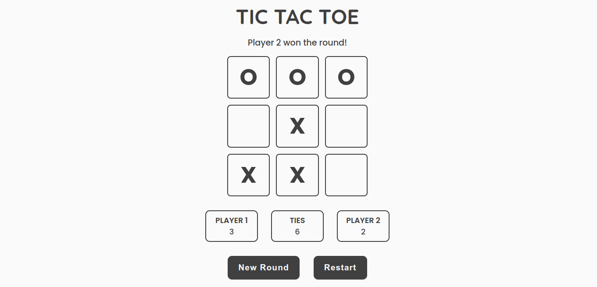

# Tic-tac-toe

A simple 2 player tic-tac-toe game, made using HTML, CSS and Javascript as a project for [The Odin Project](https://www.theodinproject.com/). The purpose of this project was to get practice the Factory Functions and Module Patterns (IIFE).

A live preview for this project is available [here](https://sh4dman23.github.io/tic-tac-toe).

## License
Distributed under MIT License. See [LICENSE](./LICENSE) for more information.

## Acknowledgements
- [The Odin Project](https://www.theodinproject.com)